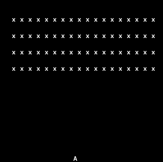

# Rust Space Invaders

It is a simple implementation of the Space Invaders on Rust using several libraries including `crossterm` for terminal rendering and `rusty_audio` for audio support.



## Getting Started

To get started with playing the Rust Space Invaders game, follow the instructions below.

### Prerequisites

Ensure you have [Rust](https://www.rust-lang.org/tools/install) and Cargo (Rust's package manager) installed on your system.

## Installation
Clone the repository to your local machine using the following command:

```sh
git clone https://github.com/mitriygor/rust-space-invaders.git
````

Navigate to the project directory:

```sh
cd rust-space-invaders
````

## Running the Game
Run the game using the following command:

```sh
cargo run
```

## Gameplay
- Use the left and right arrow keys to move your player (represented by "A") horizontally.
- Press the space bar or enter key to shoot lasers at the invaders.
- Avoid the invaders as they move closer; if they reach the bottom or if you press the 'q' or ESC key, the game ends.
- Eliminate all invaders to win the game!
